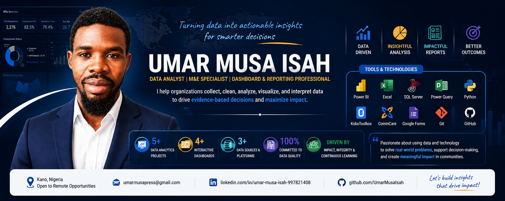

# Hi, I'm Umar Musa Isah 👋

### Data Analyst | Monitoring & Evaluation (M&E) Specialist | Dashboard & Reporting Professional

I am a Data Analyst with a strong interest in transforming raw data into actionable insights that support evidence-based decision-making.

My work combines data analytics, monitoring and evaluation (M&E), dashboard development, SQL analysis, and reporting to help organizations understand performance, measure impact, and improve decision-making. I enjoy building complete analytics solutions—from data collection and preparation to visualization and presentation.

---

# About Me

- 📊 Data Analyst specializing in analytics, reporting, and business intelligence.
- 📈 Experienced in designing interactive dashboards and KPI reporting.
- 📋 Monitoring & Evaluation (M&E) practitioner with hands-on experience in survey data analysis.
- 🌍 Passionate about humanitarian, development, and public sector analytics.
- 💡 Committed to transforming complex datasets into meaningful insights.
- 🚀 Continuously learning and improving analytical, technical, and problem-solving skills.

---

# Core Competencies

- Data Analytics
- Business Intelligence
- Dashboard Design
- Data Visualization
- Monitoring & Evaluation (M&E)
- SQL Database Analysis
- Data Cleaning & Transformation
- Power Query
- Technical Reporting
- Performance Measurement
- Evidence-Based Decision Making

---

# Tech Stack

| Category | Technologies |
|----------|--------------|
| Data Analytics | Microsoft Excel, SQL Server, Python |
| Business Intelligence | Microsoft Power BI, Power Query |
| Data Collection | KoboToolbox, CommCare, Google Forms |
| Reporting | Microsoft Word, PowerPoint |
| Version Control | Git & GitHub |

---

# Professional Highlights

- 📁 Built multiple end-to-end data analytics portfolio projects.
- 📊 Developed interactive dashboards using Microsoft Power BI and Excel.
- 🗄 Designed and queried relational databases using SQL Server.
- 📋 Managed digital survey workflows with KoboToolbox, CommCare, and Google Forms.
- 📈 Produced technical reports and executive presentations for analytical projects.
- 🌍 Focused on analytics solutions for NGOs, development programmes, and business reporting.

---

# Current Areas of Interest

I am particularly interested in projects involving:

- Monitoring & Evaluation (M&E)
- Humanitarian Data Analysis
- Business Intelligence
- Dashboard Development
- Data Visualization
- SQL Analytics
- Programme Performance Measurement
- Reporting & Decision Support
- Development Sector Analytics

---

# Featured Projects

These projects demonstrate my practical experience in data analytics, monitoring & evaluation, dashboard development, and evidence-based reporting.

---

## TVET Programme Impact Assessment ⭐

An end-to-end Monitoring & Evaluation (M&E) capstone project evaluating the effectiveness of a Technical and Vocational Education and Training (TVET) programme.

**Highlights**

- Digital data collection
- Data cleaning & transformation
- SQL Server analysis
- Excel analytics
- Interactive Power BI dashboard
- Technical report
- Executive presentation

**Tools**

Power BI • SQL Server • Excel • Power Query • KoboToolbox • CommCare • Google Forms

🔗 Repository:
https://github.com/UmarMusaIsah/TVET-Programme-Impact-Assessment

---

## Herbal Remedies Field Survey & Data Analysis

A complete field survey and analytics project designed to assess the use, perception, and effectiveness of herbal remedies through structured data collection and evidence-based analysis.

**Highlights**

- Survey design
- Field data collection
- Data cleaning
- SQL analysis
- Excel reporting
- Power BI dashboard
- Technical documentation
- Presentation

**Tools**

Excel • SQL Server • Power BI • KoboToolbox • CommCare • Google Forms

---

## Humanitarian Analytics Portfolio Projects

I have also developed several portfolio projects inspired by monitoring, evaluation, and humanitarian reporting scenarios to strengthen my analytical, dashboard development, and business intelligence skills.

Projects include:

- Education Monitoring Dashboard
- Food Security Dashboard
- Programme Performance Dashboard

These projects demonstrate practical skills in KPI development, dashboard design, SQL analysis, and data visualization using realistic datasets.

---

# Certifications

My professional development includes certifications in:

- Data Analytics (Excel, SQL & Power BI)
- Monitoring & Evaluation (M&E)
- CommCare Application Building (Dimagi)
- Managing Data with Microsoft 365
- Report Writing
- Project Management
- Food Security & Livelihood
- Gender-Based Violence (GBV) in Humanitarian Action
- Generative AI
- Responsible AI
- Professional Soft Skills

---

# GitHub Statistics

---

# Professional Interests

I am interested in opportunities involving:

- Data Analytics
- Monitoring & Evaluation (M&E)
- Business Intelligence
- Dashboard Development
- Humanitarian Analytics
- Development Sector Analytics
- Data Visualization
- Reporting & Decision Support

---

# Let's Connect

📧 **Email**

umarmusapress@gmail.com

💼 **LinkedIn**

https://www.linkedin.com/in/umar-musa-isah-997821408

🐙 **GitHub**

https://github.com/UmarMusaIsah

---

> **Turning data into actionable insights that support better decisions and measurable impact.**
